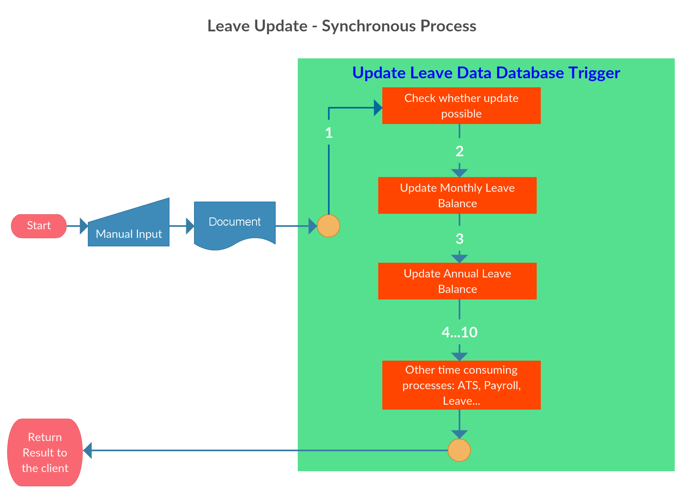

- title : Take 5 People projects
- description : My daily achievements @Take5People
- author : Alexey Zorchenkov
- theme : night
- transition : default

***

### HRMS implementation for Android

#### 

- T5PHRMS (index.android)
- Login
- UIExplorerStackReducer
- StackReducer
- UIExplorerList
- UIExplorerExampleList
- UIExplorerExampleContainer
- UIExplorerNavigationReducer
- UIExplorerActions
- UIExplorerStateTitleMap

***
- id : Login

#### Login functionality

***
- id : T5PHRMS

#### T5PHRMS functionality

***
- id : UIExplorerExampleContainer

#### UIExplorerExampleContainer functionality

***
- id : UIExplorerStackReducer

#### UIExplorerStackReducer functionality

***
- id : UIExplorerList

#### UIExplorerList functionality

***
- id : StackReducer

#### StackReducer functionality

***
- id : UIExplorerExampleList

#### UIExplorerExampleList functionality

***
- id : UIExplorerNavigationReducer

#### UIExplorerNavigationReducer functionality

***
- id : UIExplorerActions

#### UIExplorerActions functionality

***
- id : UIExplorerStateTitleMap

#### UIExplorerStateTitleMap functionality

---
- id : keys2_20160328

First

---
- id : keys3_20160328

#### Creating INITIATOR queue & define message

Second

***

### Summary

- Implemented full stack modular architecture for Android in React Native
- Ready to use solution in complimentary to cloud.t5p.hk and run on any Android device

***
