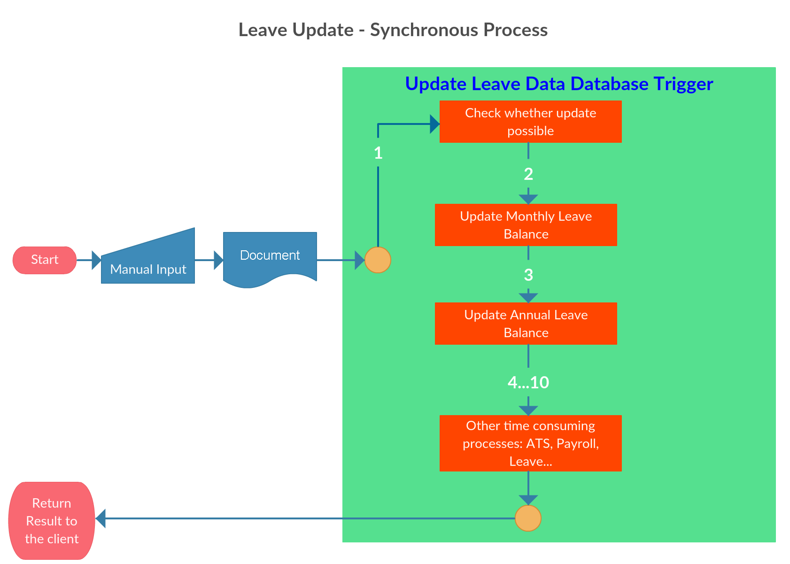

- title : Take 5 People projects
- description : My daily achievements @Take5People
- author : Alexey Zorchenkov
- theme : night
- transition : default

***

### March 28th, 2016

#### Problem

- Client complain that leave application data, such as dates, leave hours, etc... takes a lot of time
- After investigation I found that Leave Data table OnUpdate triggers takes considerable time to execute
- Key issue is that each time user updates leave data, system needs to recalculate leave balances, as well as other data

---
- id : synchronous20160328

#### Current System Synchronous workflow

---
- id : asynchronous20160328

#### Solution

- Take5People implements Service Broker services, which is part of SQL Server 2008 and above
- Complicated calculation logic, which was part of Database Leave Detail Table OnUpdate Trigger will move to independent Stored Procedure
-- SQL Server will asynchroniously call given stored procedure when a new update message arrives

---
- id : workflow20160328

#### Next generation system workflow

---
- id : keys1_20160328

#### Key questions

	[lang=sql]
	select * from sys.transmission_queue 

to see the messages in the transmission queue and to find if an error occured

Enable broker for given database:

	[lang=sql]
	ALTER DATABASE test SET SINGLE_USER WITH ROLLBACK IMMEDIATE
	GO
	ALTER DATABASE test SET ENABLE_BROKER
	ALTER DATABASE test SET MULTI_USER WITH ROLLBACK IMMEDIATE
	GO

---
- id : keys2_20160328

#### Creating TARGET queue & define message

	[lang=sql]
	CREATE MESSAGE TYPE [//t5p.hk/Leave/UpdateLeave];
	CREATE MESSAGE TYPE [//t5p.hk/Leave/LeaveUpdated];
	CREATE CONTRACT [//t5p.hk/Leave/UpdateLeaveContract]
	([//t5p.hk/Leave/UpdateLeave] SENT BY INITIATOR,
	[//t5p.hk/Leave/LeaveUpdated] SENT BY TARGET);
	CREATE SERVICE [//t5p.hk/LeaveDataService] ON QUEUE dbo.LeaveDataQueue
	([//t5p.hk/Leave/UpdateLeaveContract]);
	CREATE SERVICE [//t5p.hk/LeaveTriggerService] ON QUEUE dbo.LeaveDataQueue
	([//t5p.hk/Leave/UpdateLeaveContract]);	
	CREATE PROCEDURE dbo.usp_LeaveUpdateProc AS
		RETURN 0;
	GO	
	CREATE QUEUE dbo.LeaveDataQueue WITH ACTIVATION (
	PROCEDURE_NAME = dbo.usp_LeaveUpdateProc, MAX_QUEUE_READERS = 2,
	EXECUTE AS SELF);

---
- id : keys3_20160328

#### Creating INITIATOR queue & define message

	[lang=sql]
	CREATE PROCEDURE dbo.usp_LeaveUpdateProc2 AS
		RETURN 0;
	GO	
	CREATE QUEUE dbo.LeaveTriggerQueue WITH ACTIVATION (
	PROCEDURE_NAME = dbo.usp_LeaveUpdateProc2, MAX_QUEUE_READERS = 2,
	EXECUTE AS SELF);

	CREATE SERVICE [//t5p.hk/LeaveTriggerService] ON QUEUE dbo.LeaveTriggerQueue
	([//t5p.hk/Leave/UpdateLeaveContract]);		

***

### March 29th, 2016

- To test memory optimization solution for SQL 2014
- To share results during meeting with a client

***
